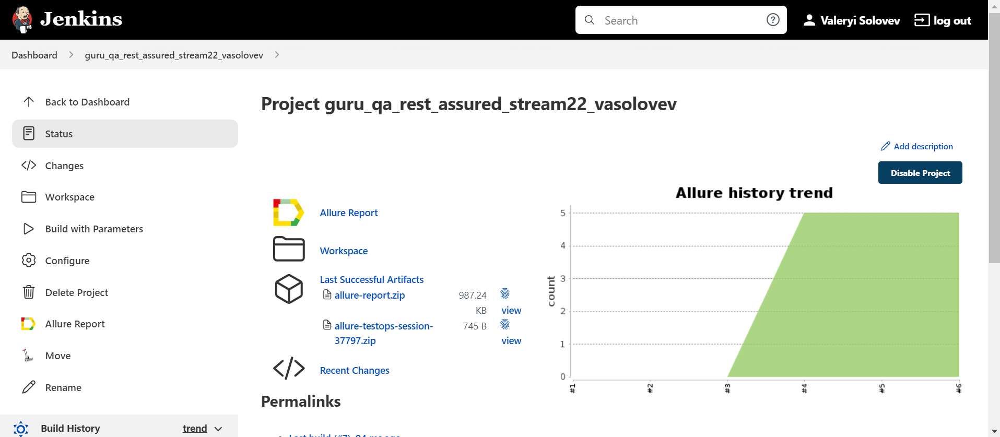
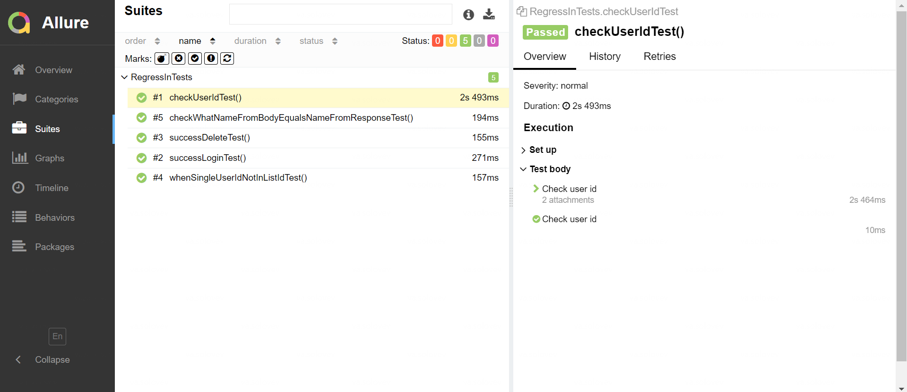
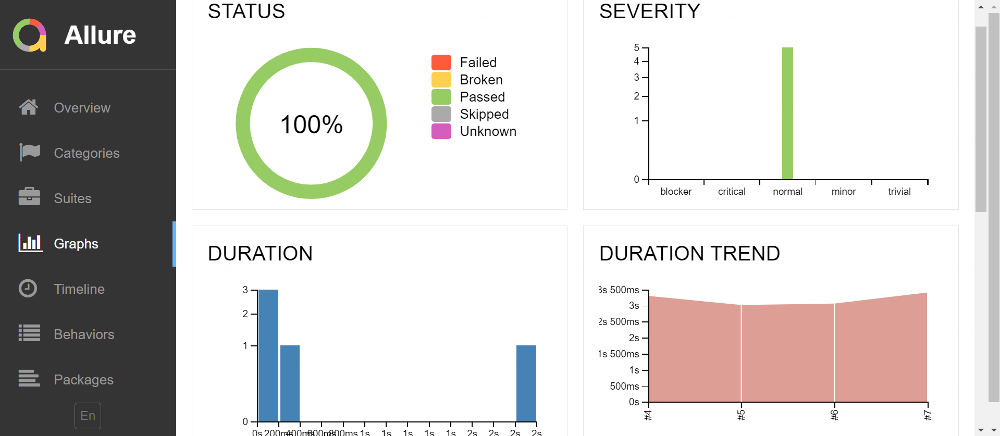
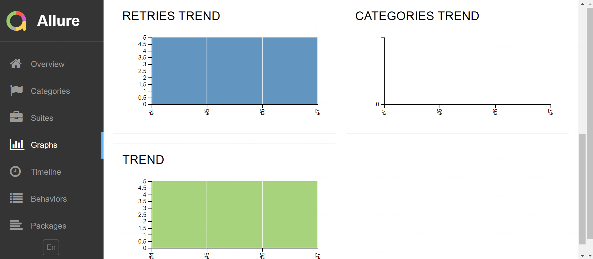
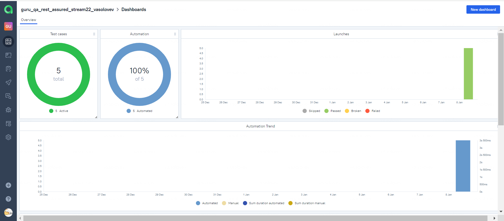
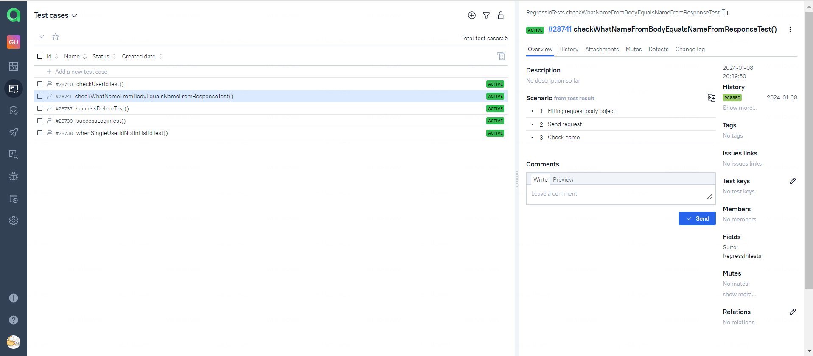
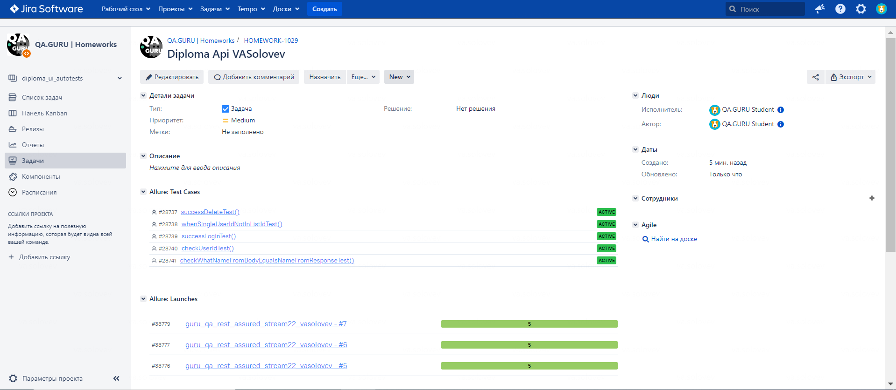
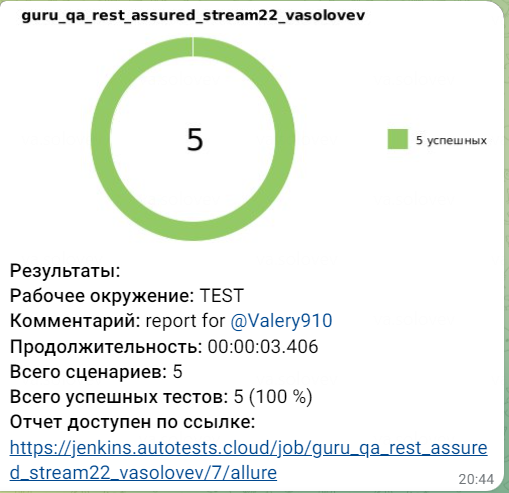

<h1>Демо проект по автоматизации тестирования API на <a href="https://reqres.in//">reqres.in</a>.</h1>

<a href="https://www.tinkoff.ru"></a>

## ☑️ Содержание:

* <a href="#tools">Технологии и инструменты</a>

* <a href="#cases">Примеры автоматизированных тест-кейсов</a>

* <a href="#jenkins">Сборка в Jenkins</a>

* <a href="#console">Запуск из терминала</a>

* <a href="#allure">Allure отчет</a>

* <a href="#allure-testops">Интеграция с Allure TestOps</a>

* <a href="#jira">Интеграция с Jira</a>

* <a href="#telegram">Уведомление в Telegram при помощи бота</a>
---

<a id="tools"></a>
<a name="Технологии и инструменты">**Технологии и инструменты:**</a>

| Java                                                                                                     | IntelliJ  <br>  Idea                                                                                                       | GitHub                                                                                                     | JUnit 5                                                                                                          | Gradle                                                                                                     | Allure <br> Report                                                                                                         | Jenkins                                                                                                          | Jira                                                                                                                                    | Telegram                                                                                                            |                                                                                                Allure <br> TestOps |RestAssured                                                                                                    |
|:---------------------------------------------------------------------------------------------------------|----------------------------------------------------------------------------------------------------------------------------|------------------------------------------------------------------------------------------------------------|------------------------------------------------------------------------------------------------------------------|------------------------------------------------------------------------------------------------------------|----------------------------------------------------------------------------------------------------------------------------|------------------------------------------------------------------------------------------------------------------|-----------------------------------------------------------------------------------------------------------------------------------------|---------------------------------------------------------------------------------------------------------------------|--------------------------------------------------------------------------------------------------------------------|---------------------------------------------------------------------------------------------------------------|
| <a href="https://www.java.com/"></a> | <a href="https://www.jetbrains.com/idea/"></a> | <a href="https://github.com/"></a> | <a href="https://junit.org/junit5/"></a>| <a href="https://gradle.org/"></a> | <a href="https://github.com/allure-framework"></a> | <a href="https://www.jenkins.io/"></a> | <a href="https://www.atlassian.com/software/jira/"></a> | <a href="https://web.telegram.org/"></a> | <a href="https://qameta.io/"></a> |<a href="https://rest-assured.io/"></a> |

* В данном проекте автотесты написаны на языке <code>Java</code> с использованием фреймворка для тестирования API RestAssured.
* В качестве сборщика был использован - <code>Gradle</code>.
* Использованы фреймворки <code>JUnit 5</code> и [RestAssured](https://rest-assured.io/).
* Для удаленного запуска реализована джоба в <code>Jenkins</code> с формированием Allure-отчета и отправкой результатов в <code>Telegram</code> при помощи бота.
* Осуществлена интеграция с <code>Allure TestOps</code> и <code>Jira</code>

Содержание Allure-отчета:
* Шаги теста;
* Логи выполнения запросов;
* Логи ответов сервера

<a id="cases"></a>
<a name="Примеры автоматизированных тест-кейсов">**Примеры автоматизированных тест-кейсов:**</a>
* Проверка userId переданного пользователя
* Проверка статус кода, при передаче пользователя отсутствующего в базе
* Проверка, что данные только что созданного клиента в базе равны переданным
* Успешная операция логина
* Успешное удаление пользователя

____
<a id="jenkins"></a>
## </a><a name="Сборка"></a>Сборка в [Jenkins](https://jenkins.autotests.cloud/job/guru_qa_rest_assured_stream22_vasolovev/)</a>
____
<p align="center">  
<a href="https://jenkins.autotests.cloud/job/guru_qa_rest_assured_stream22_vasolovev/"></a>  
</p>

### **Параметры сборки в Jenkins:**
- *ENVIRONMENT (указатель окружения для запуска тестов, по умолчанию TEST)*
- *COMMENT (переменная для передачи id telegram ответственного за прогон)*

<a id="console"></a>
## Команды для запуска из терминала
___
***Локальный запуск:***
```bash  
gradle clean test
```

***Удалённый запуск через Jenkins:***
```bash  
clean "-Denv=${ENV}" test 
```
___

___
<a id="allure"></a>
## </a> <a name="Allure"></a>Allure [отчет](https://jenkins.autotests.cloud/job/guru_qa_rest_assured_stream22_vasolovev/7/allure/)</a>
___

### *Основная страница отчёта*

<p align="center">  
  
</p>

### *Тест-кейсы*

<p align="center">  
  
</p>

### *Графики*

  <p align="center">  


  
</p>

___
<a id="allure-testops"></a>
## </a>Интеграция с <a target="_blank" href="https://allure.autotests.cloud/project/3930/dashboards">Allure TestOps</a>
____
### *Allure TestOps Dashboard*

<p align="center">  
  
</p>

### *Тестовые сценарии*

<p align="center">  
  
</p>

___
<a id="jira"></a>
## </a> Интеграция с <a target="_blank" href="https://jira.autotests.cloud/browse/HOMEWORK-1029">Jira</a>
____
<p align="center">  
  
</p>

____
<a id="telegram"></a>
## </a> Уведомление в Telegram при помощи бота
____
<p align="center">  
  
</p>